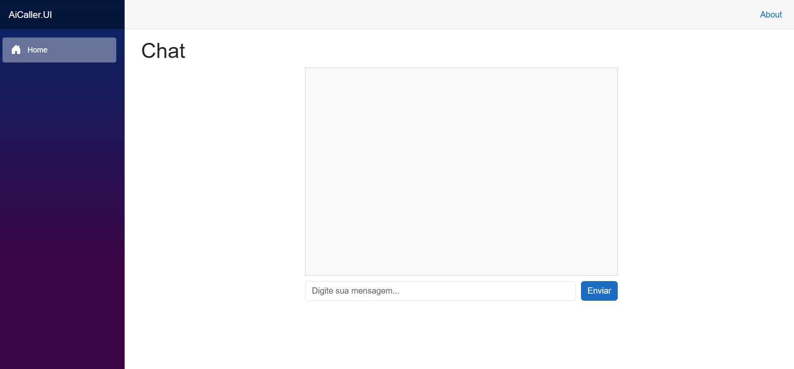

# AI Caller



Aplicação simples de chat com IA generativa, composta por backend Ollama e interface web Blazor.

## Funcionalidades

- Chat interativo com IA
- Interface web responsiva
- Backend em .NET e Ollama
- Utiliza o modelo **llama3.2:1b** para respostas inteligentes
- Inicialmente, a IA recebe um prompt para responder como o TARS do filme Interestelar, tornando as respostas mais divertidas e personalizadas.
## Observação sobre o modelo

Ao subir o container Ollama, o modelo **llama3.2:1b** será baixado automaticamente para uso no chat. Não é necessário realizar download manual.

## Visão Geral

O **AI Caller** integra um backend de IA (Ollama) e uma interface web (Blazor) para facilitar interações automatizadas e inteligentes.

### Serviços
- **Ollama**: Backend de IA, executado em container Docker, responsável pelo processamento de linguagem natural.
- **AiCaller.UI**: Interface web responsiva construída com ASP.NET Core e Blazor.

## Estrutura do Projeto

```
AI Caller.sln           # Solução principal
AICaller/               # Backend .NET
AiCaller.UI/            # Interface web Blazor
docker-compose.yml      # Orquestração dos serviços
dockerfile              # Dockerfile do serviço UI
Ollama.Dockerfile       # Dockerfile do serviço Ollama
.dockerignore           # Arquivos ignorados no build Docker
```

## Como Executar

### Pré-requisitos
- Docker e Docker Compose
- .NET 9.0 SDK (apenas para desenvolvimento local)

### Build e Execução

```sh
# No diretório raiz do projeto
docker compose build --no-cache
docker compose up
```

### Acesso aos Serviços
- Interface Web: [http://localhost:7044](http://localhost:7044)
- API Ollama: [http://localhost:11434](http://localhost:11434)

## Exemplos de Uso

1. Abra o navegador em `http://localhost:7044` para acessar a interface.
2. Envie uma mensagem no chat: a IA responderá como TARS do Interestelar.
3. Personalize o prompt inicial conforme desejado no backend.

